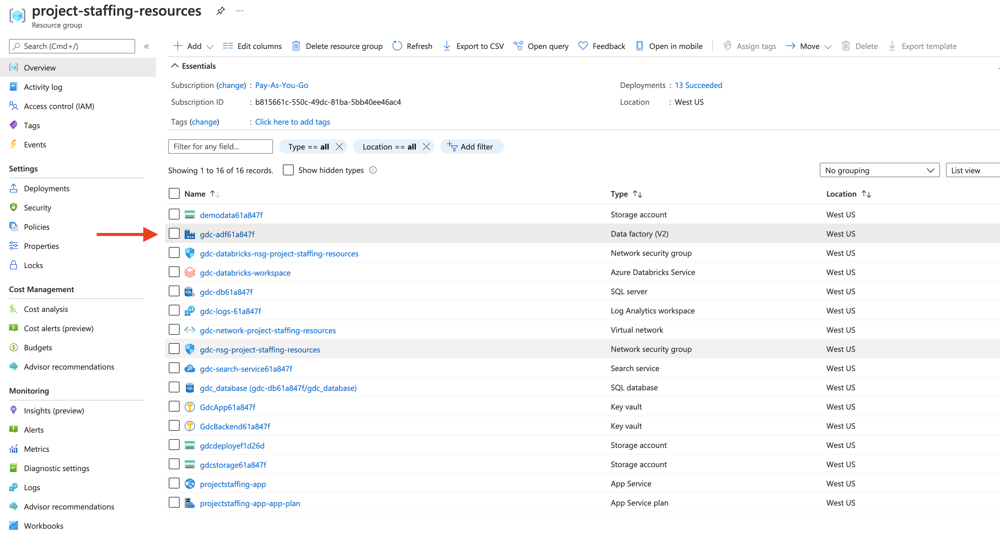
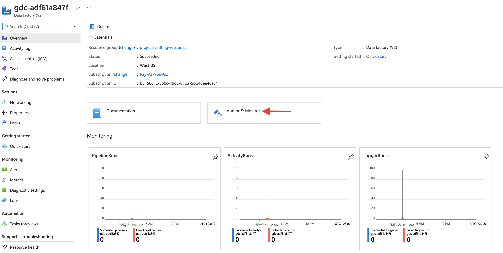
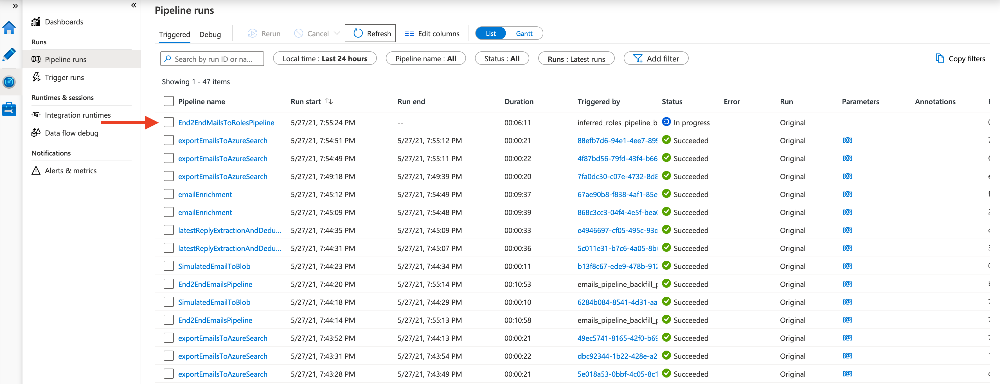
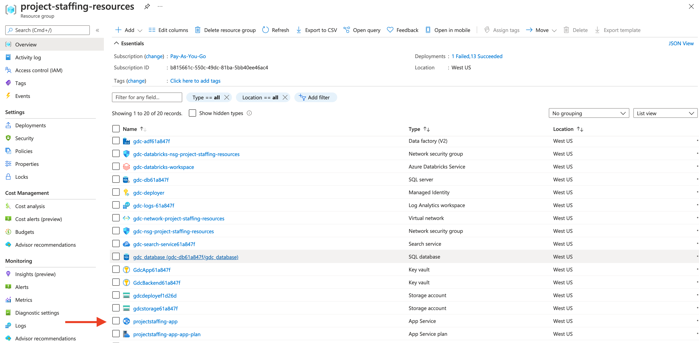

## Project Staffing deployment script

### Prerequisites
- log into your Azure portal and start the Cloud Shell terminal in __Bash__ mode
    - Powershell is __not__ supported!
- ensure Azure CLI is already installed, and the version is at least `2.16.0` (run `az version` command)
    - to update the Azure CLI to the latest version run `az upgrade`
    - Azure Cloud Shell usually comes with the latest Azure CLI version
- verify your python version by running the `python --version` command
- ensure your python version is at least 3.7+ or higher
- Azure portal user must have an Owner role in the Azure Subscription where deployment is performed

The deployment script will prompt the user to provide the names of the following AAD groups.
Ideally, the groups should be created before running the script.
- ProjectStaffing admins group
    - this defines the list of Active Directory users which are going to:
        - have Owner role over all Azure resources created by the deployment script
        - have access to restricted application functionalities, such as switching the ingestion mode or uploading new HR Data files
    - this security group is mandatory for the deployment process
- ProjectStaffing employees group
    - this defines the list of Active Directory accounts which are going to be processed by the application
    - the Project Staffing application ingests and processes employee M365 profiles and email data to infer skills and
      build better teams. However, only the data of the members of this group will be processed by the application, and
      therefore, only the employees in this group will be recommended by the application in searches
    - this security group is mandatory for the deployment process


### Performing a full deployment
Please read the full contents of this file before proceeding with the deployment

1. Build artifacts  (required for deployment), by following [these steps]( ../README.MD#building-the-artifacts-zip)

2. Upload prebuilt package (e.g. gdc-x.y.z.zip ) onto Azure CloudShell storage and unzip into your working dir.
   It will contain install.sh which is an entrypoint of deployment script.

   If the artifacts zip was ___built on a Windows machine___, you will have to perform the next steps in CloudShell:
    - because of file permissions differences between Windows and Unix based systems, the permissions to 
      the directory where the artifacts were decompressed have to be set explicitly by running the following commands:
      
      ```chmod -R +rwx <directory_path_where_artifacts_were_decompressed>/```
           
      ```chown -R <user> <directory_path_where_artifacts_were_decompressed>/```   
       
    - the Windows OS uses different line termination symbols than Unix systems, and thus modifies `.sh` files by adding 
      a `\r` character at the end of lines. As a result, the scripts can't be executed.  
      In order to remove the trailing `\r` character, run the following commands:
    
        ```sed -i 's/\r$//' install.sh ```
        
        ```sed -i 's/\r$//' uninstall.sh ```

3. Log into your account using Azure CLI
   > Note: make sure you've logged OUT from all other Azure accounts (if any) before login.
```
az login
```

4. Ensure you are deploying to the desired tenant and subscription
    - Run the following command to determine which is the default subscription assigned to your account
    `az account list --output table`
    - The result will have the following columns: Name, CloudName, SubscriptionId, State, IsDefault
    - To visualize the tenant related to each subscription, you can use a different output mode, like `tsv` or `json`
    - If you have multiple subscriptions tied to the current account, then the one for which `IsDefault` is `True`
      will be the one the deployment script will offer to use by default to perform the deployment into
    - If you desire to use a different subscription, you can pass it explicitly to the script, by providing the optional 
      argument `--subscription <subscription-id>`
        - Alternatively, if this argument is not provided, and the script encounters multiple subscriptions, then you 
        will be prompted to choose between the default subscription and a different one

5. Run deployment script from the working dir
    - You may change the deployment name and the region in the command below.
        - The deployment name is used for naming the Azure resource group.
        - The name of the App Service will be prompted for during the installation.
    - Ensure you have **at least 12 Azure DSv2 Family vCPU** in the location/subscription you deploy.
    - The deployment script is interactive and will prompt all necessary parameters.
      Most of them have default values which are good enough to go with.  
      Please read prompted instructions carefully.
    - Using the `--debug` option will expose the output of all AzureCLI commands the script executes during deployment.
```
./install.sh --deployment-name project-staffing --location westus --docker-password <docker-registry-password> --debug
```

> **Note:** Azure CloudShell has default idle timeout of 20 minutes,
> so please monitor the installation progress to avoid the script being interrupted by Cloud Shell.  
> Otherwise, you'll have to perform cleanup and **start all over**!

### Checking the deployment finished successfully
The deployment process is not yet actually finished when the deployment script completes, as the application does not
yet have any of the data that it needs to serve search requests.  
One of the last steps of the installation script is to define and start Azure DataFactory triggers, which in turn start
and orchestrate ADF pipelines, which provision the initial set of data for the application.  
__These pipelines keep on running after the deployment script completed, so monitoring them until completion is required!__  
This process takes about 30-45 minutes on the default installed configuration (using simulated data), and can be monitored
in the Azure DataFactory UI, in the "Monitor" tab. 
If production mode was chosen, then this process can take a lot longer.

The application UI can be accessed at `https://<appServiceName>.azurewebsites.net` as soon as the installation script completes.  
However, the application is fully usable only once the ADF pipelines finished running, thus providing it with the initial data.  
The last pipeline to complete is `End2EndMailsToRolesPipeline`. Once this has finished successfully, the application is ready to use.  

The required Azure DataFactory pipelines are complete once the `End2EndMailsToRolesPipeline` pipeline (which is the last
to run) finished successfully. This can be found by opening the Data Factory resource of the deployed resource group, 
selecting "Author & Monitor", then the "Monitor" tab and going to the "Pipeline Runs" section, as shown below:




You can tell that the application is ready, if the employees from the selected source can be seen in the app's main page.  
The application URL can also be found by opening the App Service resource of the deployed resource group, and looking 
for the URL in the Overview tab, as shown below:



### Notes
#### Service Principals
The following service principals get created by the deployment script (if they didn't already exist)
- gdc-service
    - this service principal is meant to be used mainly by the ADB jobs run by the ADF pipelines
- gdc-m365-reader
    - this service principal is meant to be used by ADF linked service used to read Office 365 data via Graph Data Connect
    - this service principal and "gdc-service" have predefined names, therefore they might need to be reused from one
      deployment to another
- <deployment-name>-jgraph-aad-web-app
    - this service principal is meant to be used by the AppService
    - this service principal has a globally unique name, since it relies on the app service name which is also unique

If the “gdc-service” and “gdc-m365-reader” service principals already exist when the script is run:
- the script will ask the user if the existing service principal should be used
- in this case, the use user has two options:
    - assuming this doesn't pose any security risks, reuse existing SPs by replying 'Yes' and providing the secret
      of each SP (you can either provide an existing secret, assuming you know it, or, if you are an owner of the
      SPs, you could create a new secret and provide that one)
    - reply 'No', and cause the deployment process to be aborted

#### Deployment script state and virtualenv
The script creates its own python virtualenv, rooted in `~/.gdc-env`.  
Once the script has been run for the first time on a given environment (on the Cloud Shell of a given account), in case
you want to perform changes to the python environment impacting the script, make sure to do them in the virtual env.

The deployment script stores its internal state (finished stages, prompted values, auto-generated secrets, etc.) in the `~/.gdc` folder.  
This helps with rerunning the script after partial failures, by remembering previously provided inputs and by
skipping certain previously completed steps.  
Please note that if failures occur in certain inconsistent states, then this folder needs to be deleted, and the deployment
started from a clean state.

#### Manual deployment cleanup
If you experience errors during the deployment process, and you want to make sure you start the next attempt from a fully
clean state, you can either run the uninstall script (described below) or perform manual cleanup by doing the following:
- delete the resource group created by your previous deployment attempt (regardless if it was partially or fully created)
- delete the internal state of the deployment, by deleting the `~/.gdc` folder in the Cloud Shell home folder
    - `rm -rf ~/.gdc`
- delete the virtualenv folder created by the previous deployment `~/.gdc-env`
    - `rm -rf ~/.gdc-env`
- optionally, delete the service principals created by the previous deployment:
    - <app-service-name>-jgraph-aad-web-app
    - gdc-service, gdc-m365-reader
        - should be deleted only if they were created by the deployment process (i.e. they are not used elsewhere)
        - providing their secrets during the next deployment is a better approach than deleting them

If the artifacts used for installation were __built on a Windows machine__, and you want to delete the folder containing
the artifacts, you might not be able to do that straight away, because of differences between Windows and Unix systems
file permissions. Run the following commands in order to solve the problem:  
```chmod -R +rwx <directory_path_where_artifacts_were_decompressed>/```

```chown -R <user> <directory_path_where_artifacts_were_decompressed>/```    
Then run the following command to delete the folder containing the artifacts:  
```rm -rf <directory_path_where_artifacts_were_decompressed>/```  


### Uninstalling a deployment
A project deployment might need to be cleared, for example, either following a deployment failure (so that you might
start a new deployment from a clean environment) or to free up resources on Azure once a deployment is no longer needed.  
In order to un-install the deployment you have to execute the uninstall script:
```
./uninstall.sh [--subscription-id <subscription_id_string>]
```

The subscription id of the subscription where the deployment was made, can be passed as an argument.

The uninstall script will ask for the name of the deployment to be cleaned up, in order to perform all the necessary steps.  
The name can be obtained from the resource group name which is to be cleaned, by removing the "-resources" suffix.
```
Enter deployment name: <installed-deployment-name> [press Enter]
```

If the user is a member of multiple subscriptions the uninstall script will ask for the subscription id where the deployment resides.
The user will be shown the entire list of subscriptions to which he has access:
```
Name                   CloudName    SubscriptionId                        State    IsDefault
---------------------  -----------  ------------------------------------  -------  -----------
subscription1          AzureCloud   subscription1_id                      Enabled  True
subscription2          AzureCloud   subscription2_id                      Enabled  False
...
```

The user will be shown the current subscription:
```
Current subscription: 
subscription_name  AzureCloud   subscription_id  Enabled  True
```

Then the script will ask if the current subscription is the one where the deployment resides:
```
Is the deploy part of this subscription? (Y/n) 
```

If the answer is `No` then the specific subscription id will have to be provided. 

Uninstall script will also ask if the 'gdc-service' and 'gdc-m365-reader' service principals should be deleted. The
next deployment will create them again. Alternatively, you could leave them in place, and simply provide their secrets
when performing the next deployment.  
__Since these service principals are global and could be used by multiple deployments, deleting them should only be done
with caution, if you are sure they are only used by the deployment which is about to be deleted!__
```
Would you like delete the 'gdc-service' and 'gdc-m365-reader' service principals? This is only recommended if you want to redeploy from scratch and these principals are not used elsewhere! (Y/n)
```
The script will also delete the jgraph-aad-web-app AD app registration.

Confirmation will be asked to delete deployment's the resourced group `<installed-deployment-name>-resources` and the
install script's local internal files (in `~/.gdc` and `~/.gdc-env`)
```
Deleting resource group <installed-deployment-name>-resources
Are you sure you want to perform this operation? (y/n): y
Deleting the jgraph-aad-web-app app registration from Active Directory.
Would you like delete local files related to previous deployments (if any)? Recommended if you want to redeploy from scratch (Y/n) y
```


